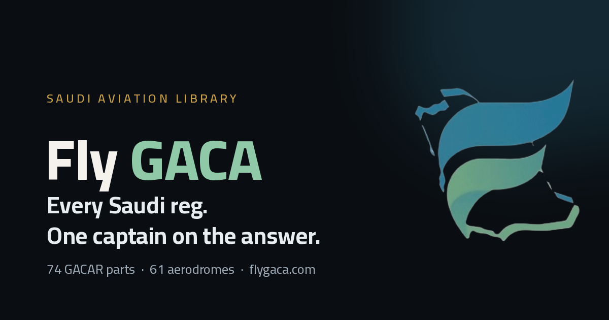

<!-- ════════════════════════════════════════════════════════════════════ -->
<!--  HERO / BRANDING                                                       -->
<!-- ════════════════════════════════════════════════════════════════════ -->

<div align="center">

<!-- Centered project logo -->


<!-- Hero banner -->


<h1>✈️ Fly GACA</h1>

### The independent flight deck for Saudi civil aviation — *find it · study it · always verify against GACA*

A bilingual (EN ⇄ AR), RTL-native platform and **open GACAR regulatory library**, paired with **Captain Adel**, a citation-first AI flight instructor.

<!-- ──────────────────────────  BADGES  ────────────────────────── -->

[](https://github.com/gacafly/FlyGACA-app/actions)
[](https://github.com/gacafly/FlyGACA-app/releases)
[](LICENSE)
[](https://flygaca.com)

<br />


</div>

> [!IMPORTANT]
> **Not affiliated with GACA.** Fly GACA helps you *find and study* regulation — it never replaces it.
> Every answer cites the exact Part/section, and every surface reinforces one rule:
> **verify against the latest official GACA publication.**

---

## 📑 Table of Contents

- [About the Project](#about-the-project)
- [Key Features](#key-features)
- [Tech Stack](#tech-stack)
- [Getting Started](#getting-started)
  - [Prerequisites](#prerequisites)
  - [Installation](#installation)
- [Usage](#usage)
- [Project Structure](#project-structure)
- [Deployment](#deployment)
- [Contributing](#contributing)
- [License](#license)
- [Contact](#contact)

---

## About the Project

**Fly GACA** is an independent, educational platform and open regulatory library for the Saudi
general-aviation community. It turns the dense world of **GACAR** (General Authority of Civil
Aviation Regulations) into something you can actually *navigate, study, and trust* — in both
**Arabic and English**, with full right-to-left support baked in from the ground up.

This repository is the **modern frontend rebuild** — a fast, offline-capable Progressive Web App
(and native iOS/Android shell) that replaces the legacy no-build vanilla PWA. It ships the
regulatory corpus, **50+ flight tools** (calculators, weather decoders, charts), a full
ground-school suite, a pilot logbook, and a direct line to **Captain Adel**, a
Retrieval-Augmented AI instructor that answers with citations to the exact regulation — never
guesswork. It is paired with a thin Firebase **Functions gateway** (`functions/`) for chat and
billing.

> [!NOTE]
> The gateway (`functions/`, Genkit) proxies `/api/chat` to **Captain Adel** and handles Stripe
> billing (`/api/stripe-webhook`); the regulatory corpus ships as static JSON under `public/data/`.
> The Captain Adel **RAG brain** the gateway calls is a separate, unchanged service.

---

## Key Features

- 📚 **Open GACAR Library** — the full regulatory corpus, browsable and searchable, shipped as a
  static JSON library that streams at runtime (the heavy corpus never bloats the JS bundle).
- 🤖 **Captain Adel — AI Flight Instructor** — a citation-first assistant that grounds every answer
  in the exact Part/section, with grounding badges, saved chats, and conversation export.
- 🧮 **50+ Flight Tools** — pure, unit-tested aviation math wrapped in a shared, shareable-by-URL
  calculator shell: crosswind, E6B/wind triangle, weight & balance, TAS/Mach, density &
  pressure altitude, ISA, climb/descent profiles, holding, fuel, great-circle, and many more.
- 🌦️ **Weather & Ops Briefings** — METAR/TAF decoders, NOTAM parsing, VFR/MET brief builders, and
  the current AIRAC cycle at a glance.
- 🗺️ **Charts, Aerodromes & Airspace** — interactive Leaflet maps plus indexed aerodrome, airspace,
  and approach-chart data for Saudi airfields.
- 🎓 **Ground School** — flashcards with spaced repetition, mock exams, quizzes, study packs,
  learning paths, and study sheets for exam prep and continued learning.
- 🧳 **Pilot Logbook & Currency** — a logbook with CSV import, recency/currency tracking,
  achievements, and a personal dashboard.
- 🌍 **Bilingual & RTL-Native** — every string lives in both `en.json` and `ar.json`; the document
  `dir` flips end-to-end, and CSS logical properties mirror the entire UI automatically.
- ⭐ **Free + Pro** — a Stripe-backed Pro tier; entitlements gate UI only (the server is the sole
  source of truth for what's granted).
- 📲 **Installable PWA + Native Apps** — app-shell precaching via Workbox for offline use, wrapped
  by Capacitor into first-class iOS and Android builds.
- ⚡ **Built for Speed** — Vite 6 + React 18, strict TypeScript, and an enforced initial-JS budget.

---

## Tech Stack

> Built on a modern, type-safe web foundation with mobile and offline as first-class citizens.

| Layer | Technology | Notes |
| :--- | :--- | :--- |
| **Build Tooling** | [Vite 6](https://vite.dev) | `tsc -b && vite build` → `dist/` (static payload + Capacitor `webDir`) |
| **UI Framework** | [React 18](https://react.dev) + [TypeScript](https://www.typescriptlang.org) | Strict mode, no implicit `any` |
| **Routing** | [React Router 6](https://reactrouter.com) | Single, declarative route table |
| **Internationalization** | [i18next](https://www.i18next.com) + react-i18next | EN/AR with document-wide RTL flipping |
| **Styling** | CSS Modules + design tokens | The *Falcon* palette; logical properties for free RTL |
| **Motion** | [Framer Motion](https://www.framer.com/motion/) | Page and micro-interactions |
| **Maps** | [Leaflet](https://leafletjs.com) | Aerodrome / airspace visualisation |
| **PWA** | [vite-plugin-pwa](https://vite-pwa-org.netlify.app) (Workbox) | App shell precached, `/data/*` network-first |
| **Native** | [Capacitor](https://capacitorjs.com) | iOS & Android shells |
| **Gateway** | [Firebase Functions](https://firebase.google.com/docs/functions) + [Genkit](https://firebase.google.com/docs/genkit) | `functions/` — proxies `/api/chat`, Stripe webhook |
| **Billing** | [Stripe](https://stripe.com) | Pro-tier checkout + webhook (server-granted entitlements) |
| **Hosting** | [Firebase](https://firebase.google.com) | Hosting (canonical) · Firestore · App Check |
| **Analytics** | [Vercel Analytics](https://vercel.com/analytics) + Speed Insights | Privacy-light usage + Core Web Vitals |
| **Testing** | [Vitest](https://vitest.dev) + [Playwright](https://playwright.dev) | Pure-logic & i18n parity · e2e + a11y |

---

## Getting Started

Follow these steps to get a local development environment running.

### Prerequisites

Make sure you have the following installed:

- **Node.js** `>= 20` (LTS recommended)
- **npm** `>= 10` (ships with Node)
- *(Optional)* **Xcode** / **Android Studio** — only if you intend to build the native shells

### Installation

```bash
# 1. Clone the repository
git clone https://github.com/gacafly/FlyGACA-app.git
cd FlyGACA-app

# 2. Install dependencies
npm install

# 3. (Optional) Configure environment
#    Copy the example env file and add your public Firebase config.
#    With no VITE_FIREBASE_* set, the app runs fully local-first — no backend required.
cp .env.example .env.local

# 4. Start the dev server (Vite + HMR)
npm run dev
```

The app will be available at **`http://localhost:5173`**.

---

## Usage

### Running the project

```bash
npm run dev          # Start the Vite dev server with hot-module reload
npm run build        # Production build → dist/  (sitemap → tsc -b → vite build)
npm run preview      # Serve the production build locally
```

### Quality gates

> [!TIP]
> Run all four before committing — CI will reject a PR that fails any of them.

```bash
npm run typecheck    # tsc -b --noEmit
npm run lint         # ESLint
npm run test         # Vitest — calc correctness + bilingual key parity
npm run test:e2e     # Playwright — smoke + accessibility
```

### Native builds

```bash
npm run cap:sync     # Build the web payload and copy it into the native shells
npm run cap:open     # Open the iOS project in Xcode
```

### Screenshots

<!-- Replace the placeholders below with real screenshots once available -->

| Library & Search | Captain Adel (AI) | Calculators |
| :---: | :---: | :---: |
|  |  |  |

> _📸 Screenshots coming soon — drop images into `docs/screenshots/` and update the paths above._

---

## Project Structure

<details>
<summary><b>Where things live</b></summary>

```text
public/data/      Static JSON corpus + content indexes (fetched at runtime)
public/brand/     Brand assets (logo mark, OG card)
src/styles/       tokens.css (the Falcon palette) + global base layer
src/i18n/         en.json / ar.json + the i18next setup
src/app/          Shared chrome: Layout, Header, Footer
src/components/   Reusable UI: LangToggle, Disclaimer, CalcShell
src/lib/          Typed services: api, auth, firebase, entitlements, content, hooks
src/calc/         Pure, unit-tested flight math (crosswind is the reference impl)
src/pages/        One folder per route — tools · study · library · chat · account · guides · legal
src/router.tsx    The single route table
functions/        Firebase Functions gateway (Genkit): chat proxy, Stripe billing
scripts/          Build/data pipelines: sitemap, airports, prerender, GACA sync
docs/             Runbooks (deploy · firebase · cutover · native) + strategy notes
tests/  ·  e2e/   Vitest specs  ·  Playwright specs
```

</details>

---

## Deployment

### Continuous Integration

CI ([`.github/workflows/ci.yml`](.github/workflows/ci.yml)) runs on every pull request as two jobs:

- **Quality** — `typecheck · lint · format:check · test · build · check:bundle` (enforced initial-JS budget ≤ 160 kB gz)
- **End-to-end** — `e2e · a11y` (Playwright)

### Hosting — one build, four fronts

**Firebase Hosting is canonical** (the `/api/*` Cloud Functions are co-located with it). **Vercel ·
Cloudflare · Netlify** are mirror fronts that proxy `/api/*` back to the Firebase gateway, so chat and
content keep working with the strict CSP unchanged.

<div align="center">

[](firebase.json)
[](vercel.json)
[](wrangler.toml)
[](netlify.toml)

</div>

```bash
# Firebase (canonical)
npm run deploy        # build + prerender → deploy hosting
npm run deploy:all    # hosting + functions + firestore rules

# Vercel       vercel deploy --prod
# Cloudflare   npx wrangler pages deploy dist --project-name flygaca-app
# Netlify      netlify deploy --build --prod
```

> [!NOTE]
> Per-platform env vars, exact commands, and a post-deploy smoke checklist live in
> [`docs/RUNBOOK-deploy.md`](docs/RUNBOOK-deploy.md). Firebase + Firestore specifics are in
> [`docs/RUNBOOK-firebase.md`](docs/RUNBOOK-firebase.md); go-live steps are in
> [`docs/RUNBOOK-cutover.md`](docs/RUNBOOK-cutover.md).

---

## Contributing

Contributions are what make the open-source community such an amazing place to learn and build.
Any contributions you make are **greatly appreciated**. 🛫

1. **Fork** the project
2. Create your feature branch — `git checkout -b feature/amazing-feature`
3. Make your changes, keeping the project conventions:
   - 🌍 **Bilingual + RTL is first-class** — add new copy to **both** `en.json` and `ar.json`
   - ⚖️ **The disclaimer is load-bearing** — render the shared `<Disclaimer />`; never reword it
   - 🎨 **Tokens only** — no hard-coded colours; logical properties only (no physical `left`/`right`)
4. Run the quality gates — `npm run typecheck && npm run lint && npm run test`
5. **Commit** your changes — `git commit -m "feat: add amazing feature"`
6. **Push** to the branch — `git push origin feature/amazing-feature`
7. Open a **Pull Request**

> [!NOTE]
> Found a bug or have an idea? [Open an issue](https://github.com/gacafly/FlyGACA-app/issues) — clear,
> reproducible reports help everyone.

> [!TIP]
> Writing **guide content** (no coding required)? See [`GUIDE_AUTHORING.md`](GUIDE_AUTHORING.md) —
> `npm run new:guide` scaffolds a new guide, and you fill in the bilingual prose.

---

## License

Distributed under the **MIT License**. See [`LICENSE`](LICENSE) for more information.

---

## Contact

| | |
| :--- | :--- |
| **Author** | FlyGACA |
| **GitHub** | [@gacafly](https://github.com/gacafly) |
| **Email** | [i@flygaca.com](mailto:i@flygaca.com) |
| **Website** | [flygaca.com](https://flygaca.com) |
| **Project Link** | [github.com/gacafly/FlyGACA-app](https://github.com/gacafly/FlyGACA-app) |

---

<div align="center">

<sub>Built for the Saudi GA community · <b>find it · study it · always verify against GACA</b></sub>

<br /><br />

<b>صُنع في السعودية 🇸🇦 · Made in Saudi Arabia</b>

</div>
