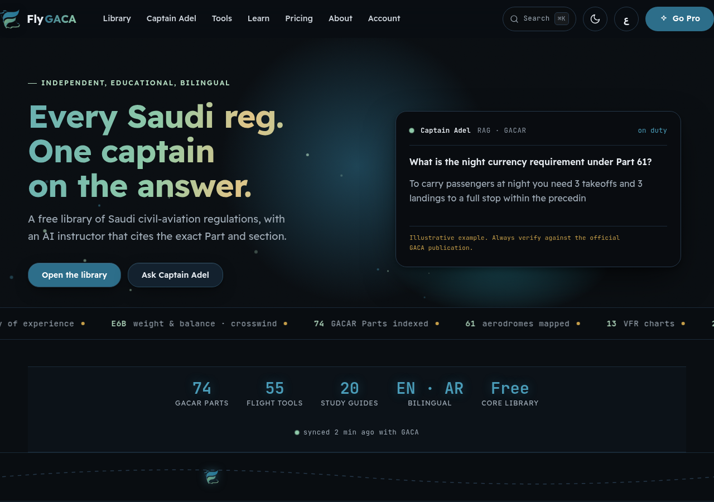
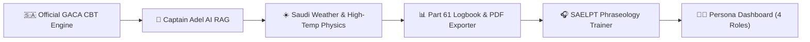
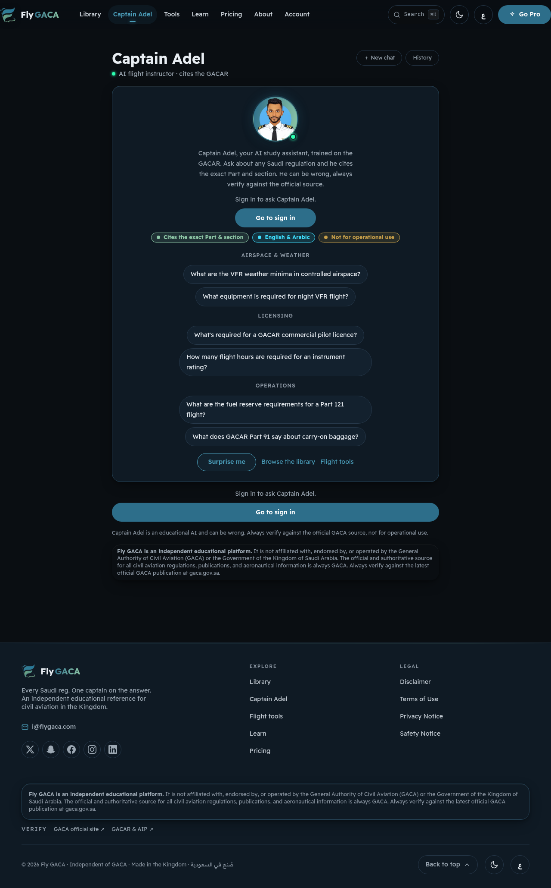
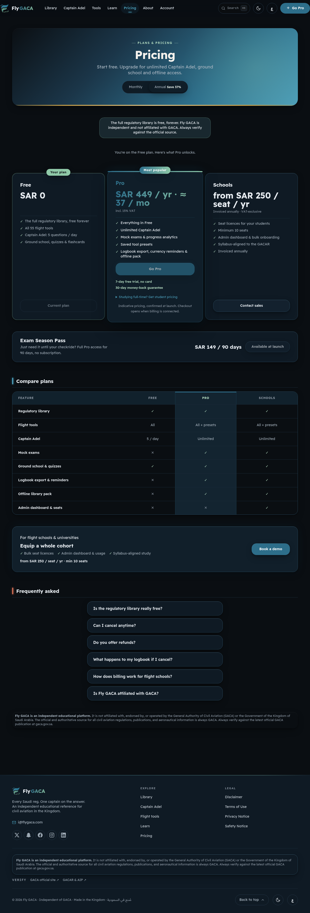
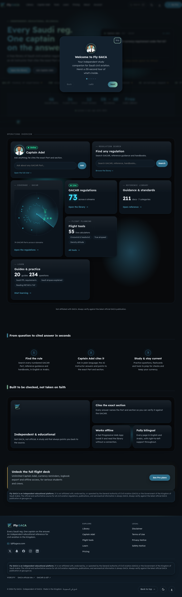
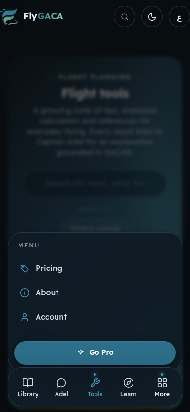
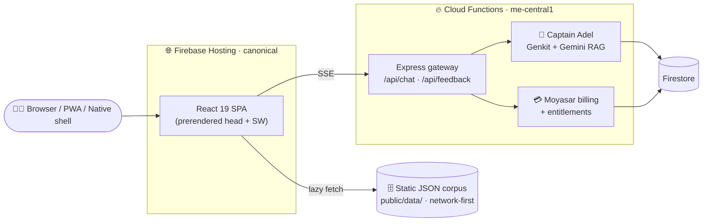

<!-- ════════════════════════════════════════════════════════════════════ -->
<!--  HERO / BRANDING                                                       -->
<!-- ════════════════════════════════════════════════════════════════════ -->

<div align="center">


# ✈️ Fly GACA

### The Independent Flight Deck & Aviation Intelligence Platform for Saudi Arabia 🇸🇦

**_find it · study it · master GACAR · always verify against GACA_**

<!-- Modern Status Badges -->
<p align="center">
  <a href="https://github.com/FlyGACA/FlyGACA-app/actions/workflows/ci.yml">
    
  </a>
  <a href="https://flygaca.com">
    
  </a>
  <a href="https://flygaca.com">
    
  </a>
  <a href="https://flygaca.com">
    
  </a>
  <a href="https://flygaca.com">
    
  </a>
</p>

<!-- Tech Stack Pills -->
<p align="center">
  
  
  
  
  
  
</p>

<!-- Quick links -->
<p align="center" style="margin-top: 1.5rem;">
  <a href="https://flygaca.com" style="color: #2d6e8a; text-decoration: none; font-weight: 600;"><b>🌐 Live App (flygaca.com)</b></a>
  &nbsp;·&nbsp;
  <a href="#-whats-new--key-capabilities" style="color: #2d6e8a; text-decoration: none; font-weight: 600;"><b>🌟 What's New</b></a>
  &nbsp;·&nbsp;
  <a href="#-get-started-in-60-seconds" style="color: #2d6e8a; text-decoration: none; font-weight: 600;"><b>⚡ Quick Start</b></a>
  &nbsp;·&nbsp;
  <a href="#-architecture--tech-stack" style="color: #2d6e8a; text-decoration: none; font-weight: 600;"><b>🏗️ Architecture</b></a>
</p>

<br />



</div>

> [!IMPORTANT]
> **Independent Platform — Not affiliated with GACA.** Fly GACA helps student pilots, commercial aviators, instructors, and dispatchers *find, study, and compute* aviation regulations — it never replaces official authority publications. Every answer cites exact GACAR Parts & sections. Always verify against the latest official GACA publications.

---

<div align="center">

## 📑 Table of Contents

[About](#-about-the-project) · [What's New](#-whats-new--key-capabilities) · [Key Features](#-key-features) · [App Family](#-exam-prep-app-family) · [Quick Start](#-get-started-in-60-seconds) · [Architecture](#-architecture--tech-stack) · [Deploy](#-deploy) · [License](#-license)

</div>

---

## 🌟 What's New & Key Capabilities

<div align="center">


</div>


```mermaid
flowchart LR
    A["🇸🇦 Official GACA CBT Engine"] --> B["🤖 Captain Adel AI RAG"]
    B --> C["☀️ Saudi Weather & High-Temp Physics"]
    C --> D["📊 Part 61 Logbook & PDF Exporter"]
    D --> E["🎧 SAELPT Phraseology Trainer"]
    E --> F["👨‍✈️ Persona Dashboard (4 Roles)"]
```

### 🚀 Highlights

- 🇸🇦 **GACA Official CBT Exam Simulator**: Interactive GACA test-center simulator matching Riyadh & Jeddah exam room screens, 75% pass mark, fuel-gauge timer, question bookmarking, and official GACA Practice Exam Transcript certificate card.
- 👨‍✈️ **Persona-Driven Dynamic Dashboard**: 4 role onboarding presets (*Student Pilot*, *Commercial Pilot*, *Flight Instructor*, *Flight Dispatcher*) with role-aware widget layout ordering.
- ☀️ **Saudi Weather & High-Temp Physics**: Extreme desert heat alerts (> 45°C) with engine/takeoff distance degradation penalties, Saudi weather hazard decoders (*Shamal* dust storms & *Haboob* low visibility), and high-elevation aerodrome advisories (Abha OEAB @ 6,857 ft, Taif OETF @ 4,769 ft).
- 🎧 **SAELPT Audio Phraseology Trainer**: Interactive ICAO Level 4+ radiotelephony scenarios for Riyadh Approach (OERK), Jeddah Tower (OEJN), and Dammam Radar (OEDF) with Captain Adel ATC readback integration.
- 📊 **GACA Part 61 Logbook & PDF Exporter**: 90-day passenger recency warning badges, RFC 4180 multiline CSV parser, one-click ForeFlight/Garmin Pilot import template (`flygaca-logbook-template.csv`), and printable A4 Landscape logbook PDF exporter (`/logbook?print=1`).
- 🛬 **Aircraft Crosswind Limits Visualizer**: Max demonstrated crosswind limit presets (C172S: 15 kts, DA40: 20 kts, PA28: 17 kts, SR22: 21 kts) with visual exceedance warnings on `/tools/crosswind` and `/tools/wind-table`.
- 🌌 **Constellation Map Category Filters**: Interactive category node filtering on `/library/map` (Part 61 Licensing, Part 91 Operating, Part 121 Transport, Part 141 ATOs).
- 🤝 **Fly Together Referral & BNPL (Tamara/Tabby)**: One-click WhatsApp pilot group sharing ("1 Month Free Pro for you & your classmate") + Tamara / Tabby 4 interest-free installment badges on `/pricing` and Exam Packs.
- 🔑 **Apple Sign-In & Contextual Auth**: Seamless `OAuthProvider('apple.com')` integration, Google One-Tap, and URL-stateful auth navigation (`/account?mode=up`).

---

## 🎯 About the Project

**Fly GACA** is a bilingual (EN ⇄ AR), RTL-native open regulatory library, EFB flight deck, and aviation intelligence platform built for civil aviation cadets, pilots, instructors, dispatchers, and flight academies across the Kingdom of Saudi Arabia and GACA territory.

This monorepo ships a strict-TypeScript **React 19 + Vite 8** frontend plus its **Firebase Cloud Functions** backend gateway. Together they power a fast, offline-capable Progressive Web App (and native iOS/Android shells via Capacitor) putting the full regulatory corpus (74 GACAR Parts), **55+ flight calculators**, and **Captain Adel** — a citation-first Retrieval-Augmented AI flight instructor — in the palm of your hand.

---

## 🚀 Key Features

Everything below is built to accelerate study, sharpen flight planning, and democratize access to aviation regulation.

| Feature | What You Get |
| :--- | :--- |
| 🎓 **GACA CBT Exam Simulator** | Realistic test center interface with 75% GACAR pass mark, fuel-gauge timer, and official GACA transcript cards. |
| 🤖 **Captain Adel AI** | Grounded AI flight instructor providing **citation-first** answers linked directly to GACAR Parts. |
| 🧮 **55+ Flight Tools** | Crosswind, weight & balance SVG plot, density altitude, ISA, E6B, critical point, hydroplaning speed, and climb gradient. |
| ☀️ **Saudi Desert Weather** | High-temp alerts (> 45°C), *Shamal* & *Haboob* decoders, and high-elevation rules for Abha & Taif airports. |
| 📊 **Logbook & PDF Exporter** | Part 61 logbook with 90-day passenger recency badge, RFC 4180 multiline CSV parser, and A4 landscape PDF export (`/logbook?print=1`). |
| 🎧 **SAELPT Phraseology** | Radiotelephony scenarios for Riyadh, Jeddah, and Dammam towers with Captain Adel readback integration. |
| 👨‍✈️ **Persona Dashboard** | Customized widget layouts for Student Pilots, Commercial Aviators, Instructors, and Flight Dispatchers. |
| 💳 **Moyasar & BNPL (Tamara/Tabby)** | Native Saudi Mada, Apple Pay, STC Pay, and Tamara / Tabby 4-installment visual badges for Pro & Exam Packs. |
| 🌍 **Bilingual & RTL** | Instant EN ⇄ AR switching with automatic Readex Pro typography & CSS logical properties mirroring. |
| 📲 **PWA & Native Shells** | Offline Workbox caching or native Capacitor iOS & Android builds. |

---

## 📸 A Look Inside

<table style="border-collapse: collapse;">
  <tr>
    <td width="50%" align="center" style="padding: 1rem;">
      <a href="https://flygaca.com/chat" style="text-decoration: none;">
        
      </a>
      <br /><sub><b style="color: #2d6e8a;">🤖 Captain Adel</b><br />citation-first AI instructor</sub>
    </td>
    <td width="50%" align="center" style="padding: 1rem;">
      <a href="https://flygaca.com/tools/crosswind" style="text-decoration: none;">
        
      </a>
      <br /><sub><b style="color: #2d6e8a;">🧮 Flight tools</b><br />shareable, URL-stateful math</sub>
    </td>
  </tr>
  <tr>
    <td width="50%" align="center" style="padding: 1rem;">
      <a href="https://flygaca.com/ar" style="text-decoration: none;">
        
      </a>
      <br /><sub><b style="color: #8fc9a8;">🌍 Bilingual & RTL</b><br />fully mirrored Arabic</sub>
    </td>
    <td width="50%" align="center" style="padding: 1rem;">
      <a href="https://flygaca.com/pricing" style="text-decoration: none;">
        
      </a>
      <br /><sub><b style="color: #8fc9a8;">💳 Pricing</b><br />free core library, Pro upgrade</sub>
    </td>
  </tr>
  <tr>
    <td width="50%" align="center" style="padding: 1rem;">
      
      <br /><sub><b style="color: #2d6e8a;">👋 First-visit tour</b><br />onboarding for new pilots</sub>
    </td>
    <td width="50%" align="center" style="padding: 1rem;">
      
      <br /><sub><b style="color: #8fc9a8;">📱 Mobile navigation</b><br />the full app in your pocket</sub>
    </td>
  </tr>
</table>

<div align="center"><sub style="color: #666;">Screenshots from the live app — explore it at <a href="https://flygaca.com" style="color: #2d6e8a;">flygaca.com</a>.</sub></div>

---

## 🧭 Experience Lanes

<table style="border-collapse: collapse;">
  <tr>
    <td width="33.33%" align="center" style="padding: 1rem;">
      <a href="https://flygaca.com/library" style="text-decoration: none;">
        
      </a>
      <br /><sub><b style="color: #2d6e8a;">📚 Library lane</b><br />find Parts, sections, and references fast</sub>
    </td>
    <td width="33.33%" align="center" style="padding: 1rem;">
      <a href="https://flygaca.com/learn" style="text-decoration: none;">
        
      </a>
      <br /><sub><b style="color: #8fc9a8;">🎓 Study lane</b><br />guides, packs, flashcards, mock exams</sub>
    </td>
    <td width="33.33%" align="center" style="padding: 1rem;">
      <a href="https://flygaca.com/dashboard" style="text-decoration: none;">
        
      </a>
      <br /><sub><b style="color: #2d6e8a;">🚀 Growth lane</b><br />account, pricing, schools, and progression</sub>
    </td>
  </tr>
</table>

---

## 🎓 Exam-Prep App Family

Beyond the main app, Fly GACA ships an **ASA-Prepware-style family of focused study apps** — *one GACA certificate = one app*. Each is a slice of the same shared corpus (quiz banks, flashcards, timed mock exam, mastery tracking) delivered two ways:

- 🌐 **Web** — a live pack page at `flygaca.com/study/packs/<id>`, served from **this monorepo**.
- 📱 **Native iOS** — a SwiftUI app (`com.flygaca.<id>`) whose code lives in the separate [`ay2m/FlyGACA`](https://github.com/ay2m/FlyGACA) repo. This monorepo stays the **source of truth for their content** — `scripts/build-ios-content.mjs` generates each app's `Content/` from the corpus + `src/lib/prepCatalog.ts`, and the iOS repo pulls it in.

Every pack below is live on the **web**. The **iOS** column tracks the native app only.

| App | Certificate / rating | Primary GACAR source | Web | iOS |
| :--- | :--- | :--- | :--- | :--- |
| **ELPT** | English Language Proficiency (SAELPT) | ICAO LPR (Fly GACA authored) | ✅ Live | ✅ Live |
| **AIP** | Aeronautical Information | SANS Saudi AIP (GEN/ENR) | ✅ Live | ✅ Live |
| **PPL** | Private Pilot Licence | Parts 61 · 91 · 71 · 67 + Saudi AIP | ✅ Live | ⏸ Paused |
| **CPL** | Commercial Pilot Licence | Parts 61 · 91 · 119 · 135 | ✅ Live | ⏸ Paused |
| **IR** | Instrument Rating | Parts 61 · 91 · 97 + AIP ENR | ✅ Live | ⏸ Paused |
| **ATPL** | Airline Transport Pilot Licence | Parts 61 · 121 | ✅ Live | ⏸ Paused |
| **Later** | Flight Instructor · Dispatcher · AME · UAS · … | per-certificate GACAR | 🔜 Roadmap | 🔜 Roadmap |

> The licence-exam **iOS apps** are paused pending a strategic decision; their web packs are
> unaffected and still selling. See [`docs/APPS-FAMILY-ROADMAP.md`](docs/APPS-FAMILY-ROADMAP.md).

> [!IMPORTANT]
> **Sources: GACA · SANS · Fly GACA — only.** Every app is grounded in GACA (GACAR regulations, Advisory Circulars, the GACARs eBook), SANS (the Saudi AIP), and Fly-GACA-authored practice material — enforced mechanically by [`tests/lib/pack-sources.test.ts`](tests/lib/pack-sources.test.ts). The CPL/IR/ATPL question banks are **draft pending human review** (see [`docs/STUDY-CONTENT-REVIEW.md`](docs/STUDY-CONTENT-REVIEW.md)); practice questions are Fly-GACA authored and are **not** real GACA exam questions.

<div align="center"><sub style="color: #666;">The full lineup, App Store bundle and Android plan live in <a href="docs/APPS-FAMILY-ROADMAP.md" style="color: #2d6e8a;">docs/APPS-FAMILY-ROADMAP.md</a>.</sub></div>

---

## ⚡ Get Started in 60 Seconds

Get a local dev environment running in under a minute.

### Prerequisites

- **Node.js** `20` (matches CI)
- **npm** `>= 10`

### Quick Start

```bash
# 1. Clone the repository
git clone https://github.com/FlyGACA/FlyGACA-app.git
cd FlyGACA-app

# 2. Install dependencies
npm install

# 3. (Optional) Configure your local environment
cp .env.example .env.local

# 4. Launch the dev server
npm run dev
```

Open **`http://localhost:5173`** and you're flying. 🛫

> [!TIP]
> Without `VITE_FIREBASE_*` variables set, the app runs **local-first** — the corpus, tools, and ground school all work offline; only backend features like Captain Adel AI stay dark until you wire up Firebase.

---

## 🏗️ Architecture & Tech Stack

Engineered for performance, offline reliability, and strict type safety.


```mermaid
flowchart LR
    U([👩‍✈️ Browser / PWA / Native shell])

    subgraph EDGE["🌐 Firebase Hosting · canonical"]
      SPA["React 19 SPA<br/>(prerendered head + SW)"]
    end

    subgraph API["🔥 Cloud Functions · me-central1"]
      GW["Express gateway<br/>/api/chat · /api/feedback"]
      RAG["🧠 Captain Adel<br/>Genkit + Gemini RAG"]
      BILL["💳 Moyasar billing<br/>+ entitlements"]
    end

    DATA[("🗄️ Static JSON corpus<br/>public/data/ · network-first")]
    FS[("Firestore")]

    U --> SPA
    SPA -->|"lazy fetch"| DATA
    SPA -->|"SSE"| GW
    GW --> RAG
    GW --> BILL
    RAG --> FS
    BILL --> FS
```

<table style="border-collapse: collapse; width: 100%; margin-top: 1rem;">
<tr style="background: linear-gradient(90deg, rgba(45, 110, 138, 0.05), rgba(143, 201, 168, 0.05));">
  <td width="50%" style="padding: 1.5rem; border-left: 4px solid #2d6e8a;">

**Frontend**
- ⚛️ React 19 · Vite 8 · TypeScript (strict)
- 🧭 `react-router` — single route table
- 🎨 CSS Modules + design tokens (logical properties)
- 🌐 i18next — bilingual EN/AR with RTL mirroring
- 📦 `vite-plugin-pwa` (Workbox) service worker

  </td><td width="50%" style="padding: 1.5rem; border-right: 4px solid #8fc9a8;">

**Backend & Native**
- 🔥 Firebase Cloud Functions (Express) · `me-central1`
- 🧠 Genkit + Gemini RAG (Captain Adel)
- 💳 Moyasar billing & entitlements
- 📱 Capacitor iOS / Android shells
- 🗄️ Static JSON corpus streamed from `public/data/`

  </td>
</tr>
</table>

### Core Commands

> [!TIP]
> `npm run verify` chains **every** CI gate — `typecheck → lint → format:check → test → build → check:bundle`. A green local `verify` means a green CI.

```bash
npm run verify      # ⭐ Run the full CI gate before every commit
npm run typecheck   # Strict TypeScript (tsc -b --noEmit)
npm run lint        # ESLint
npm run test        # Vitest — calc correctness & i18n parity
npm run test:e2e    # Playwright — smoke & accessibility
npm run build       # Production assets → dist/
npm run preview     # Serve the production build locally
```

> [!NOTE]
> `functions/` (the Firebase Cloud Functions backend) is its **own npm package with its own CI gate** — root `verify` does not cover it. Touching it? Run `npm run lint && npm test && npm run build` inside `functions/` too.

### Native Mobile Shells

The `ios/`/`android/` platform projects are **generated on the build machine, never committed**
(`.gitignore` excludes both) — Capacitor 8 uses Swift Package Manager, so no CocoaPods. See
[`docs/RUNBOOK-native.md`](docs/RUNBOOK-native.md) for the full setup.

```bash
npm install         # SPM references node_modules/@capacitor/* — install first
npm run build       # produce dist/ (cap copies it into the shell)
npx cap add ios     # generate ios/ (once per machine, or per flavor via npm run flavor:ios)
npx cap sync ios    # copy web assets + regenerate the SPM manifest
npm run cap:open    # open ios/App in Xcode → set signing team → run
```

---

## 🌍 Deploy

**Firebase Hosting is the single serving front** — it hosts the SPA, fronts the Cloud Functions
gateway (`/api/*`), and owns Auth/Firestore. One platform, one CSP (`firebase.json`), one deploy.

<div align="center">

**Deployment Platform**

[](firebase.json)

</div>

```bash
npm run deploy        # Build, prerender, and deploy to Hosting
npm run deploy:all    # Deploy Hosting, Functions, and Firestore rules
```

> [!NOTE]
> For CI logic, multi-platform deploy commands, and cutover steps, see the runbooks in `docs/` — `RUNBOOK-deploy.md`, `RUNBOOK-firebase.md`, `RUNBOOK-native.md` (the completed cutover is archived at `archive/docs/RUNBOOK-cutover.md`).

---

## 🤝 Contribute

Join the mission to modernize Saudi general aviation. PRs welcome! 🛫

1. **Fork** the project and create a feature branch — `git checkout -b feature/amazing-feature`.
2. **Build** your change. Adhere to the two enforced conventions: **bilingual keys in both** `en.json` **and** `ar.json`, and **CSS logical properties only** (no hard-coded colours, no physical `left`/`right`).
3. **Verify** with `npm run verify` — this is the same gate CI runs.
4. **Commit** with a semantic message — `feat: add amazing feature`.
5. **Push** and open a Pull Request.

> [!TIP]
> Adding a tool or a guide? Register tools in `src/lib/tools.ts` (the single source of truth) and lift the math into `src/calc/`. Authoring educational content? Run `npm run new:guide` and read [`GUIDE_AUTHORING.md`](docs/GUIDE_AUTHORING.md). New contributors should skim [`CLAUDE.md`](CLAUDE.md) for the enforced conventions and [`ROADMAP.md`](ROADMAP.md) for what's next.

---

## 📄 License

Distributed under the **MIT License**. See [`LICENSE`](LICENSE) for details.

---

## 📖 The whole family, one book

New to the Fly GACA ecosystem? [**The Book of Fly GACA**](https://github.com/ay2m/FlyGACA/blob/main/THE-BOOK-OF-FLY-GACA.md) maps all ten repositories — this monorepo, the Captain Adel service, the native iOS family, the six App Store repos and the Office — with the shared principles, the cross-platform data-parity contracts and the glossary in one place.

| Repo | What it holds |
| --- | --- |
| **FlyGACA/FlyGACA-app** (this repo) | flygaca.com — the React/Vite web app, Firebase backend, regulatory corpus + content pipelines |
| [FlyGACA/Captain-Adel](https://github.com/FlyGACA/Captain-Adel) | The AI flight-instructor service (captadel.com) + the shared brain behind chat |
| [ay2m/FlyGACA](https://github.com/ay2m/FlyGACA) | The native iOS app family — FlyGACAKit + the ELPT and AIP App Store targets |
| [FlyGACA/ELPT](https://github.com/FlyGACA/ELPT) · [AIP](https://github.com/FlyGACA/AIP) · [PPL](https://github.com/FlyGACA/PPL) · [CPL](https://github.com/FlyGACA/CPL) · [IR](https://github.com/FlyGACA/IR) · [ATPL](https://github.com/FlyGACA/ATPL) | Per-app App Store metadata repos — store listing copy, screenshots, per-app roadmap |
| [FlyGACA/Office](https://github.com/FlyGACA/Office) | The business operating system — strategy, governance, legal, finance, GTM docs |

---

## 📬 Contact

| | |
| :--- | :--- |
| **Author** | Fly GACA |
| **Operator** | BDA Company International (شركة بدع الدولية) — CR 7030976893, Riyadh, Saudi Arabia |
| **GitHub** | [@FlyGACA](https://github.com/FlyGACA) |
| **Email** | [i@flygaca.com](mailto:i@flygaca.com) |
| **Support** | [support@flygaca.com](mailto:support@flygaca.com) · [flygaca.com/support](https://flygaca.com/support) |
| **Website** | [flygaca.com](https://flygaca.com) |
| **Project** | [github.com/FlyGACA/FlyGACA-app](https://github.com/FlyGACA/FlyGACA-app) |

---

<div align="center">

<br />

**Built for the Saudi GA community**

<sub style="color: #2d6e8a;">**find it · study it · always verify against GACA**</sub>

<br /><br />

<b style="color: #8fc9a8; font-size: 1.1em;">صُنع في السعودية 🇸🇦 · Made in Saudi Arabia</b>

</div>
