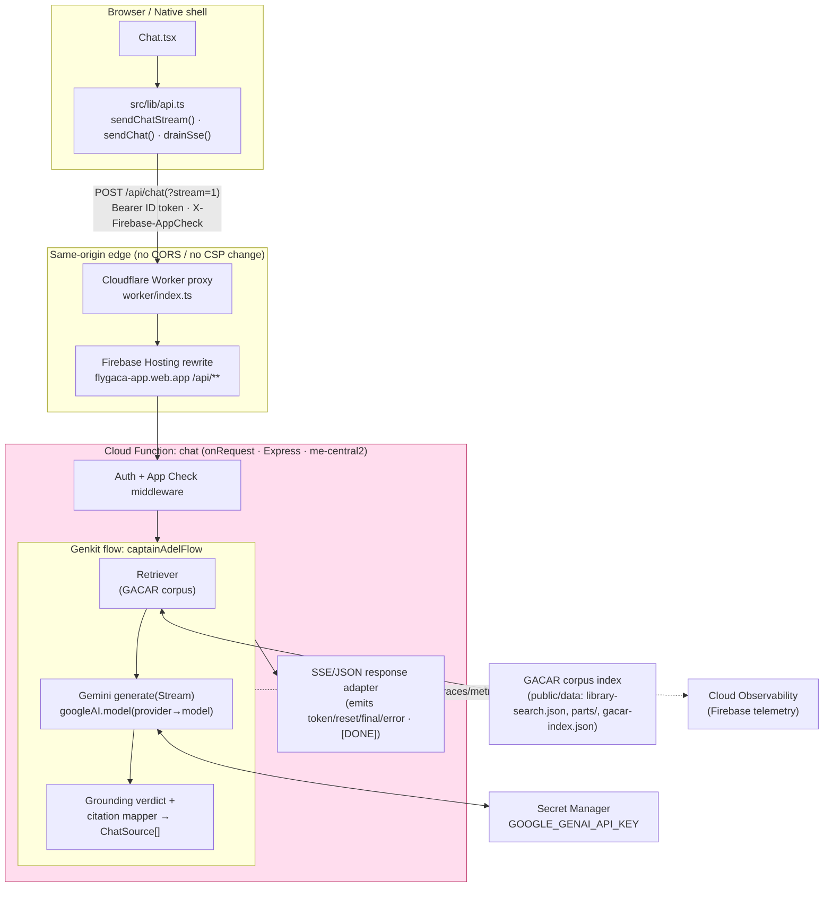
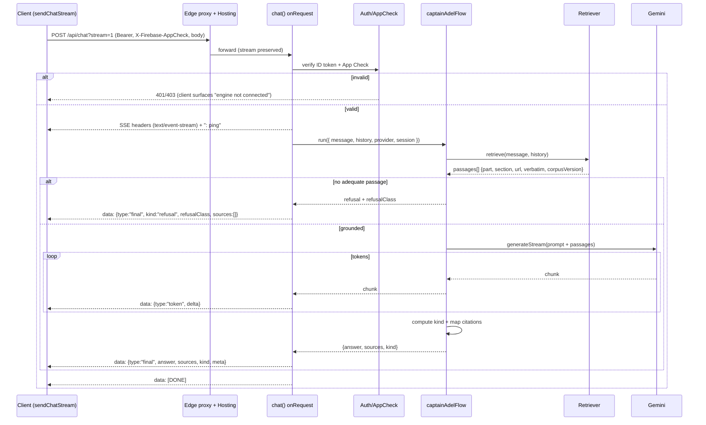
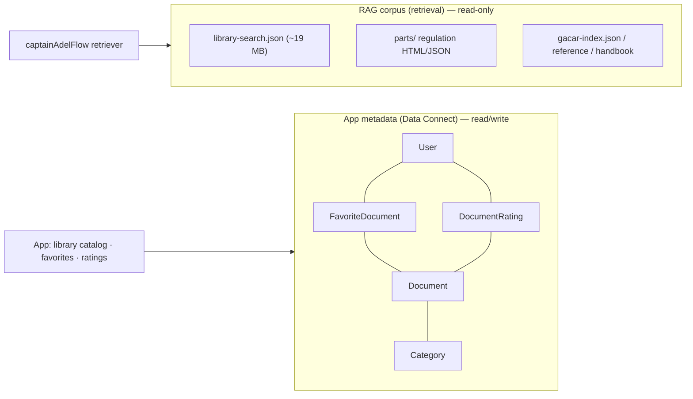

# Design — Captain Adel Genkit RAG backend (`/api/chat` gateway)

> **Type:** architecture · **Format:** spec + diagrams · **Status:** v1 implemented (see §13) —
> all decisions resolved (Gemini · static BM25 retrieval · `onRequest`/SSE).
>
> **Scope:** the server-side RAG gateway that answers Fly GACA's *Ask Captain Adel* chat, now that
> `functions/` has been scaffolded with [Genkit](https://firebase.google.com/docs/genkit). This
> document does **not** touch the frontend — the frontend contract in
> [`src/lib/api.ts`](../src/lib/api.ts) is the fixed input this design is built around.

---

## 1. Context & problem statement

The app is frontend-complete. The chat UI ([`src/pages/chat/Chat.tsx`](../src/pages/chat/Chat.tsx))
consumes a typed client ([`src/lib/api.ts`](../src/lib/api.ts)) that already implements:

- **Buffered** `POST /api/chat` → `ChatResponse`.
- **Streamed** `POST /api/chat?stream=1` → an **SSE frame protocol** (`token` / `reset` / `final` /
  `error`, `[DONE]` sentinel, `: ping` keep-alives) drained by the unit-tested `drainSse()`.
- A **graceful fallback**: if the stream endpoint answers with buffered JSON, the client synthesizes
  a single `final` event, so the UI never branches on which path served it.

Two things in the repo now point in different directions:

| Artifact | What it implies |
|---|---|
| [`worker/index.ts`](../worker/index.ts) | A **Cloudflare Worker** proxy that forwards `/api/*` to the deployed Firebase gateway at `https://flygaca-app.web.app` — it treats Captain Adel's brain as an **already-hosted origin**, not something rebuilt at deploy time. |
| [`functions/src/genkit-sample.ts`](../functions/src/genkit-sample.ts) | A **fresh Firebase Cloud Functions + Genkit** scaffold (Gemini via `@genkit-ai/google-genai`, `onCallGenkit`, Firebase telemetry, `defineSecret("GOOGLE_GENAI_API_KEY")`, Node 24, functions v7). |

**The decision this design resolves:** *if* Captain Adel's brain is to be (re)built in this repo on
Genkit, how does it satisfy the **existing** `/api/chat` contract with **zero frontend change** — and
where the scaffold's defaults (`onCallGenkit`) are wrong for that contract, what replaces them.

### Non-goal / guardrail (load-bearing)

Fly GACA is **independent and educational — not affiliated with GACA**. The assistant helps users
*find and study* regulation; it must **cite the exact Part/section** and must **refuse or "hold"**
when an answer isn't grounded in the corpus. This is not a nicety — it is a hard output requirement
that the grounding verdict (`kind`) and `refusalClass` encode end-to-end.

---

## 2. Requirements

### Functional
- **F1 — Contract parity.** Implement `POST /api/chat` (buffered) and `POST /api/chat?stream=1`
  (SSE) byte-compatible with `src/lib/api.ts`. No frontend edits.
- **F2 — RAG.** Retrieve relevant passages from the GACAR corpus and ground the answer in them.
- **F3 — Citations.** Every answer returns `sources[]` shaped as `ChatSource`
  (`citation`, `url`, `verbatim?`, `section?`, `part?`, `corpusVersion?`).
- **F4 — Grounding verdict.** Emit `kind ∈ {grounded, partial, refusal, na}` and, on refusal, a
  `refusalClass` (the cited rule, e.g. `91.155(a)(2)`).
- **F5 — Streaming.** Token deltas stream as they generate; a `final` frame carries the settled
  answer + sources + verdict; `reset` is supported (brain restart); `error` is a stream-level fault.
- **F6 — Request envelope.** Accept `{ message, history[], product='flygaca', provider?, session? }`.
  `provider` selects the model/profile; `session` correlates a conversation.

### Non-functional
- **N1 — Auth.** Honor `Authorization: Bearer <Firebase ID token>` and `X-Firebase-AppCheck`.
  App Check **enforced** in production (see [`docs/APP-CHECK-BACKEND.md`](./APP-CHECK-BACKEND.md)).
- **N2 — Region.** Deployed in `me-central1` (`functions/src/region.ts` is the single source of
  truth; firebase.json's rewrite `region` fields must match it by hand). Moving to `me-central2`
  (co-located with Firestore) remains a deliberate, separate migration.
- **N3 — Secrets.** Model API keys live in **Cloud Secret Manager** (`defineSecret`), never in code
  or env files committed to the repo.
- **N4 — Cost control.** Bounded `maxInstances`; per-session rate limiting; cancel generation when
  the client disconnects.
- **N5 — Observability.** Genkit traces + Firebase telemetry for every flow run (latency, tokens,
  retrieval hits, verdict distribution).
- **N6 — No new CSP origin / no CORS.** Responses stay same-origin behind `/api` (the Cloudflare
  proxy and Hosting rewrite already make this true; `connect-src 'self'` must remain valid).
- **N7 — Faithful degradation.** When retrieval is empty or the model is unavailable, return a
  **grounded refusal / "engine not connected"**, never a hallucinated regulatory figure.

---

## 3. Key decisions

### D0 — Ownership: Gemini becomes the brain; the co-located gateway **replaces** the legacy service ✅ (OQ-1 resolved)
**Decision:** the Genkit project in `functions/` is the **new, co-located Captain Adel brain**,
powered by **Gemini** (`@genkit-ai/google-genai`). It **replaces** the legacy Fly GACA RAG
service. The legacy brain is retained only as an instant-rollback origin during cutover (§9), not as
a permanent second provider.

Consequences:
- **No multi-vendor abstraction.** There is a single model family (Gemini). The request's `provider`
  field is repurposed to select the **Gemini model tier** (e.g. `gemini-2.5-flash` for normal turns,
  `gemini-2.5-pro` for hard/long-context turns) — not a different vendor. Default = `flash`.
- **`CLAUDE.md` must be updated** once this lands: today it says the backend is "separate and
  unchanged," which this decision reverses.
- The gateway still **must** honor the existing `/api/chat` contract verbatim (§6) so the frontend
  is untouched. Parity is proven by shadowing the legacy brain before the cutover (§9).

### D1 — Transport: `onRequest` (Express) gateway, **not** `onCallGenkit`
The scaffold's `onCallGenkit` exposes a Firebase **callable** (its own JSON-RPC-ish envelope and
streaming format). The frontend speaks **raw HTTP + a custom SSE frame protocol**. Wrapping Genkit
in `onCallGenkit` would force a frontend rewrite and break `drainSse()`.

**Decision:** expose an `onRequest` HTTP function (Express app) that:
1. runs auth/App Check middleware,
2. invokes the Genkit flow (`captainAdelFlow`),
3. **translates** the flow's stream/result into the legacy SSE frames (or buffered JSON).

Genkit still powers retrieval, generation, tracing, and structured output internally — we just keep
its wire protocol *off the public edge*. `genkit-sample.ts` stays as a reference example and is not
exported from `index.ts`.

### D2 — Retrieval source ✅ (OQ-4 resolved: static lexical index for v1)
Three candidates; pick by corpus size and freshness needs:

| Option | Fit | Notes |
|---|---|---|
| **Pre-built static index** (`public/data/library-search.json` ~19 MB + `parts/`) | ✅ Fastest path; reuses the corpus the app already ships | Lexical/BM25 or embed-on-cold-start; deterministic; no extra infra. Best for v1. |
| **Vector store** (Vertex AI Vector Search / a managed pgvector) | Scales to semantic recall | Adds infra + indexing pipeline; warranted only if lexical recall proves insufficient. |
| **Firebase Data Connect** ([`dataconnect/schema/schema.gql`](../dataconnect/schema/schema.gql)) | ❌ for passage retrieval | That schema (`User`, `Document`, `Category`, `FavoriteDocument`, `DocumentRating`) is **app metadata** — document catalog, favorites, ratings — **not** chunk-level RAG. See §7. |

**Decision (locked):** v1 retrieves from the **existing static corpus** via a Genkit retriever
backed by a **lexical/BM25 index** (built at cold start or shipped pre-built), returning chunks that
carry `{ part, section, url, verbatim, corpusVersion }` so citations are exact. No new infra, no
indexing pipeline, deterministic results. Track recall via the §10 metrics; promote to a vector
store (Vertex AI Vector Search + Gemini embeddings) or hybrid rerank **only if** recall falls
short — the retriever's interface (§6.3) is the seam that swap happens behind, so it is a contained
change.

### D3 — Grounding verdict is computed, not asked-for-politely
The model is instructed to answer **only** from retrieved passages and to cite. A deterministic
post-step sets `kind`:
- `grounded` — answer's claims map to ≥1 retrieved passage; sources non-empty.
- `partial` — answer partially supported; some claims uncited → surfaced as "partially grounded."
- `refusal` — no adequate passage; return the cite-the-rule refusal + `refusalClass`.
- `na` — small-talk / meta with no regulatory claim (no badge shown).

This keeps the badge honest even when a model is over-confident.

---

## 4. Component architecture



**Why the adapter (`SSE`) is its own seam:** it is the single place that owns the legacy frame
protocol. The Genkit flow stays protocol-agnostic (returns a typed object + an async token stream);
the adapter maps that to either SSE frames or buffered JSON. This is what makes F1 (contract parity)
testable in isolation and keeps a future protocol change (e.g. true callable) a one-file swap.

---

## 5. Request flow (streamed turn)



Buffered `POST /api/chat` (no `?stream=1`) runs the same flow and returns the `final` payload as a
single JSON `ChatResponse`. Client disconnect aborts `generateStream` (N4).

---

## 6. Interface specifications

These are the **public contract** (frozen by the frontend) and the **internal flow** shapes. They
are specifications, not implementations.

### 6.1 Public HTTP contract (must not drift from `src/lib/api.ts`)

```
POST /api/chat            → 200 application/json   ChatResponse
POST /api/chat?stream=1   → 200 text/event-stream  (SSE frames below) ; OR application/json ChatResponse (fallback)

Headers (request):  Content-Type: application/json
                    Authorization: Bearer <Firebase ID token>      (optional → anonymous/limited)
                    X-Firebase-AppCheck: <token>                   (enforced in prod)
Errors:             non-2xx → client throws; UI degrades to "engine not connected"
```

```jsonc
// Request body
{ "message": "string",
  "history": [{ "role": "user|assistant", "content": "string" }],
  "product": "flygaca",        // default
  "provider": "string?",       // Gemini model tier: "flash" (default) | "pro"
  "session": "string?" }

// ChatResponse (buffered, and the shape inside the SSE `final` frame)
{ "answer": "string",
  "sources": [{ "citation": "GACAR Part 91 §91.155", "url": "/library/...",
                "verbatim": "…", "section": "91.155", "part": "91",
                "corpusVersion": "Rev 2024-06" }],
  "kind": "grounded|partial|refusal|na",
  "refusalClass": "91.155(a)(2)",   // present on refusal
  "meta": { "provider": "gemini-2.5-flash" } }
```

**SSE frame protocol** (one JSON object per `data:` line; `: ping` keep-alives ignored; `[DONE]` ends):
```
data: {"type":"reset"}
data: {"type":"token","delta":"…"}
data: {"type":"final","answer":"…","sources":[…],"kind":"grounded","meta":{…}}
data: {"type":"error","code":"…"}
data: [DONE]
```

### 6.2 Internal Genkit flow (Zod-typed; spec, not code)

```ts
// captainAdelFlow — input
{ message: string; history: {role,content}[]; product: string;
  provider?: string; session?: string }

// captainAdelFlow — output (adapter maps this → ChatResponse / SSE `final`)
{ answer: string;
  sources: ChatSource[];
  kind: 'grounded'|'partial'|'refusal'|'na';
  refusalClass?: string;
  meta: { provider: string; retrieved: number; corpusVersion: string } }

// streamSchema — the token delta string streamed to sendChunk()
```

### 6.3 Retriever contract
```ts
retrieve(query: { message, history }, k: number)
  → { text, part, section, url, corpusVersion, score }[]
```
The mapper turns each kept passage into a `ChatSource` (`verbatim = text`, `citation` from
`part`/`section`). This is the **only** place `verbatim`/`corpusVersion` are sourced — guaranteeing
the UI's expandable-passage and "corpus revision" features have real data.

---

## 7. Data: corpus vs. app metadata (two stores, don't conflate)



- The **RAG corpus** is the static, versioned regulatory text the answer is grounded in. It is the
  retriever's source and the origin of every `ChatSource`.
- **Data Connect** ([`schema.gql`](../dataconnect/schema/schema.gql)) is the *document catalog +
  user signals* (favorites, ratings). It is **not** a passage index and is out of the chat hot path.
  It *may* later enrich a source's `url`/title, but it never replaces corpus retrieval.

> **OQ-2:** is Data Connect intended for the chat path at all, or purely for the Library's
> catalog/favorites/ratings? This design assumes the latter.

---

## 8. Security, cost & observability

- **App Check (N1):** middleware verifies `X-Firebase-AppCheck`; `enforceAppCheck` on in prod.
  Follow [`docs/APP-CHECK-BACKEND.md`](./APP-CHECK-BACKEND.md). Unverified → 403 (UI degrades
  gracefully — the client already handles a failed request).
- **Auth (N1):** verify the Firebase ID token if present. Anonymous turns allowed but
  rate-limited/feature-limited per product policy (mirror the legacy brain — **OQ-3**).
- **Secrets (N3):** `defineSecret("GOOGLE_GENAI_API_KEY")` bound to the `chat` function only.
- **Cost (N4):** `setGlobalOptions({ maxInstances })`; per-`session`/per-uid token-bucket limit;
  abort `generateStream` on client disconnect; cap `history` length and retrieved-context tokens.
- **Region (N2):** `me-central2`.
- **Observability (N5):** `enableFirebaseTelemetry()` + Genkit traces — track latency, tokens,
  retrieved-passage count, and `kind` distribution (a refusal-rate spike = retrieval regression).
- **Faithfulness (N7, guardrail):** empty retrieval ⇒ refusal frame, never an invented figure;
  this is asserted by tests (§10) and is the server-side twin of the site-wide `<Disclaimer />`.

---

## 9. Rollout

1. **Shadow.** Deploy the Gemini `chat` function to a preview/secondary path; replay sampled turns;
   diff answers, citations, and `kind` against the legacy brain to prove parity before cutover.
2. **Model-tier flag.** Use the request's `provider` value (`flash`/`pro`) to A/B the Gemini tier —
   no contract change.
3. **Cut over.** Point the Hosting `/api/chat` rewrite at the Gemini function; keep the legacy brain
   as instant rollback (the Cloudflare proxy origin is a one-line change). Retire it once stable.
4. **Docs.** Update `CLAUDE.md`, `MIGRATION.md`, and `docs/RUNBOOK-deploy.md` to reflect the
   Gemini-powered co-located brain; remove the "backend is in another repo / unchanged" note.

---

## 10. Validation criteria (definition of done for the design)

- **Contract:** `drainSse()` and `src/lib/api.ts` parse real responses unchanged; an SSE turn yields
  ≥1 `token` then a `final`; buffered turn yields a valid `ChatResponse`. (Reuse the existing chat
  e2e mock as the conformance fixture.)
- **Grounding:** a question with corpus support ⇒ `grounded` + ≥1 `ChatSource` with real
  `verbatim`/`part`/`section`; an out-of-corpus question ⇒ `refusal` + `refusalClass`, **no**
  fabricated figure.
- **Citations:** every `sources[].url` resolves to a real Library route; `corpusVersion` reflects
  the indexed revision.
- **Security:** missing/invalid App Check ⇒ 403 in prod; secret never present in logs/bundle.
- **Ops:** traces show retrieval-hit count and verdict per run; `maxInstances` enforced.
- **Bundle:** no change to the frontend bundle (server-only work).

---

## 11. Open questions

| # | Question | Default assumed here |
|---|---|---|
| ~~OQ-1~~ | ~~Replace the legacy brain, or add Gemini as a selectable `provider`?~~ | **Resolved: Gemini replaces the legacy brain; `provider` = Gemini model tier (§3 D0).** |
| OQ-2 | Is Data Connect part of the chat path? | No — catalog/favorites/ratings only (§7). |
| OQ-3 | Anonymous-user policy (allowed? limited?) | Allowed, rate-limited — mirror legacy. |
| ~~OQ-4~~ | ~~Retrieval: lexical static index vs. vector store for v1?~~ | **Resolved: static lexical/BM25 index over the shipped corpus for v1 (§3 D2); vector only if recall fails.** |
| OQ-5 | Does the legacy brain support multi-turn `reset`, and when is it emitted? | Supported in adapter; semantics TBD from legacy. |

---

## 12. Next step

Both gating decisions are resolved — **OQ-1: Gemini replaces the legacy brain**; **OQ-4: static
lexical/BM25 retrieval over the shipped corpus for v1**. The architecture is complete and ready to
build.

v1 is now implemented (§13). Remaining open questions (OQ-2/3/5) are policy/clarity details, not
blockers.

---

## 13. Implementation status (v1)

Built in `functions/src/` (Node 24, functions v7, Genkit 1.37, CommonJS):

| Module | Role |
|---|---|
| `contract.ts` | The frozen public contract (mirrors `src/lib/api.ts`): `ChatRequest`/`ChatResponse`/`ChatSource`/`StreamEvent`. |
| `corpus.ts` | Lazy, cached corpus load (`CORPUS_URL` → Hosting `/data` or local file) + **BM25** inverted index over `library-search.json`; `toChatSource()`/`searchHref()` replicate the frontend's route mapping. |
| `captain-adel.ts` | Genkit `captainAdelFlow` — retrieve → grounded prompt → Gemini `generateStream` → server-side verdict → citations. `provider` ∈ {`flash`,`pro`}. |
| `sse.ts` | Legacy SSE frame serializer (`data:` frames, `[DONE]`, `: ping`). |
| `gateway.ts` | Express app: auth + App Check middleware, `POST /chat` buffered + `?stream=1` SSE, client-disconnect abort, error frames. |
| `index.ts` | `export const chat = onRequest({ region: "me-central2", secrets:[GOOGLE_GENAI_API_KEY], memory:"1GiB", timeoutSeconds:300 }, app)`. |

**Verified** (`functions/smoke.mjs`, against the real 46,369-entry corpus): `tsc` strict build green;
corpus indexes in ~0.6 s; relevant queries return ranked, route-mapped, version-stamped citations;
out-of-corpus queries return zero hits (→ server-side refusal); SSE frames match `drainSse()`.

**Not verifiable here** (needs deployed secrets): the live Gemini call, App Check enforcement, and
the end-to-end stream — these require `GOOGLE_GENAI_API_KEY` in Secret Manager and a deploy.

**Tuning knobs (env):** `RETRIEVE_K`, `REFUSE_SCORE`, `GROUNDED_SCORE`, `CORPUS_URL`,
`ENFORCE_APP_CHECK`. The BM25 thresholds are conservative v1 defaults — calibrate against a recall
eval set (§10) before cutover.

**Known v1 limits:** BM25 is lexical → Arabic queries against the English corpus have weak recall
(promote to embeddings per §3 D2 if needed); disconnect aborts the consumer but the upstream model
stream isn't hard-cancelled; grounding verdict is retrieval-confidence-based, not claim-level.

**Follow-ups (not blockers):** `functions/` lint is dead scaffold config (Google-style
`.eslintrc.js` shadowed by the repo's root flat config + a removed `--ext` flag) — wire it into the
repo's Prettier/flat-ESLint setup. Update `CLAUDE.md`'s "backend is separate and unchanged" line at
cutover.
